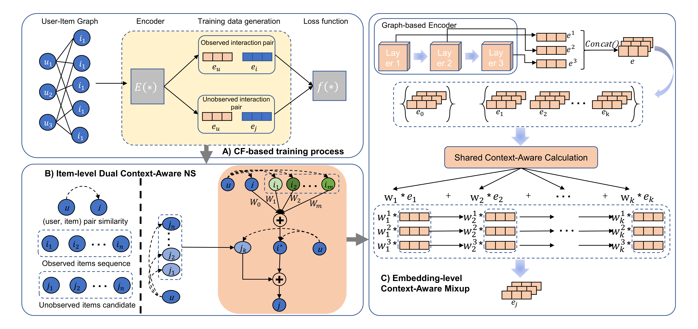

# Dual Context-Aware Negative Sampling Strategy for Graph-based Collaborative Filtering

[](https://link-to-your-paper.pdf)

Official PyTorch implementation of our CIKM 2025 paper:

> **Dual Context-Aware Negative Sampling Strategy for Graph-based Collaborative Filtering**  
> Xi Wu, Wenzhe Zhang, [Add other authors]  
> Accepted at *The 34th ACM International Conference on Information and Knowledge Management (CIKM 2025)*

---

## 📌 Introduction

Negative sampling plays a critical role in training graph-based collaborative filtering (GCF) models.  
Traditional negative sampling strategies often ignore **global** and **local** contextual information, leading to suboptimal performance.  

In this work, we propose **Dual Context-Aware Negative Sampling (DCANS)**, which integrates:
- **Global context**: semantic similarities across the entire user–item graph.
- **Local context**: neighborhood-aware sampling to capture fine-grained relationships.

Our method improves both **alignment** and **uniformity** in the learned embeddings, leading to more robust recommendations.

<p align="center">
  
</p>

---

## 🚀 Features
- **Dual Context-Aware Sampling**: Combines global and local graph contexts for negative sample selection.
- **Plug-and-Play**: Can be easily integrated into existing GCF models such as LightGCN, NGCF, etc.
- **State-of-the-Art Performance**: Achieves significant improvement on multiple benchmark datasets.

---

## ⚙️ Environment Requirements

The code has been tested with **Python 3.8.0** and **PyTorch 2.0.0**.  

Install dependencies with:

```bash
pip install -r requirements.txt
```

### Required Packages
- `torch==2.0.0`
- `numpy==1.22.4`
- `scipy==1.10.1`
- `scikit-learn==1.1.3`
- `prettytable==2.1.0`


## 🏃‍♂️ Training

All command-line arguments are defined in [`utils/parser.py`](utils/parser.py).  
Below are the **key arguments** when using **DCANS**:

```bash
--alpha         # Controls how strongly synthesized hard negatives are pushed towards positives
--window_length # Length of the user's historical interaction sequence
--n_negs        # Number of negative candidates sampled with DCANS
```


Example: LightGCN with DCANS
```Python
# Ali dataset
python main.py --dataset ali --dim 64 --lr 0.001 --l2 0.001 \
  --batch_size 2048 --gpu_id 1 --pool mean --ns dcans \
  --alpha 5.3 --n_negs 64 --window_length 5 > dcans_lightgcn_ali.log

# Gowalla dataset
python main.py --dataset gowalla --dim 64 --lr 0.001 --l2 0.001 \
  --batch_size 2048 --gpu_id 1 --pool mean --ns dcans \
  --alpha 0.02 --n_negs 64 --window_length 8 > dcans_lightgcn_gowalla.log

# Amazon dataset
python main.py --dataset amazon --dim 64 --lr 0.001 --l2 0.001 \
  --batch_size 2048 --gpu_id 1 --pool mean --ns dcans \
  --alpha 2 --n_negs 64 --window_length 5 > dcans_lightgcn_amazon.log
```


## 📝 Citation
If you find this repository useful, please cite our paper:

```bibtex
@inproceedings{wu2025dcans,
  title={Dual Context-Aware Negative Sampling Strategy for Graph-based Collaborative Filtering},
  author={Wu, Xi and Zhang, Wenzhe and Others},
  booktitle={Proceedings of the 34th ACM International Conference on Information and Knowledge Management},
  year={2025},
  publisher={ACM}
}
```


