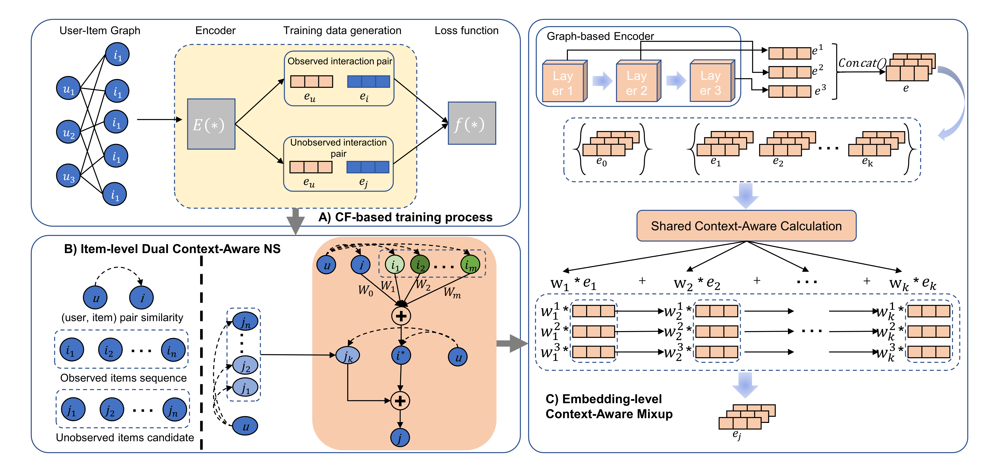

# Dual Context-Aware Negative Sampling Strategy for Graph-based Collaborative Filtering

[](https://link-to-your-paper.pdf)

Official PyTorch implementation of our CIKM 2025 paper:

> **Dual Context-Aware Negative Sampling Strategy for Graph-based Collaborative Filtering**  
> Xi Wu, Wenzhe Zhang, Liangwei Yang, Xiaohan Fang, Jiquan Peng, Jibing Gong. 
> Accepted at *The 34th ACM International Conference on Information and Knowledge Management (CIKM 2025)*

---

## 📌 Introduction
Negative sampling(NS) is a core component in training collaborative filtering models with implicit feedback, as it directly determines the quality and direction of the optimization signal.
Recent mixup-based negative sampling strategies have shown promising improvements by synthesizing harder negatives near the decision boundary. However, these methods typically assume that all observed interactions are reliable positives.

In practice, implicit feedback data often contains false positives, such as accidental clicks or exploratory interactions. Blindly pairing such noisy positives with overly hard negatives may amplify misleading gradients and degrade recommendation performance.

In this work, we propose **Dual Context-Aware Negative Sampling (DCANS)**, a principled negative sampling strategy for graph-based collaborative filtering.
Instead of uniformly hardening all training samples, DCANS explicitly models two complementary contexts derived from the optimization structure of the BPR loss:

- **Positive reliability context**: How well an observed positive item aligns with the user’s true interest.

- **Negative relevance context**: How relevant a candidate hard negative is to the same user interest.

By jointly considering these two factors, DCANS adjusts both the training direction and negative hardness, mitigating the negative impact of false positives while preserving the benefits of hard negative sampling.

<p align="center">
  
</p>

---

## 🚀 Features
- **Dual Context-Aware Design**: DCANS is built upon a theoretical decomposition of the BPR loss, revealing: **a false-positive correction term**, and **a negative boundary reweighting term**. 

- **Plug-and-Play**: Can be easily integrated into existing GCF models such as LightGCN, NGCF, etc.

- **State-of-the-Art Performance**: Achieves significant improvement on multiple benchmark datasets.

---

## ⚙️ Environment Requirements

The code has been tested with **Python 3.8.0** and **PyTorch 2.0.0**.  

Install dependencies with:

```bash
pip install -r requirements.txt
```

### Required Packages
- `torch==2.0.0`
- `numpy==1.22.4`
- `scipy==1.10.1`
- `scikit-learn==1.1.3`
- `prettytable==2.1.0`


## 🏃‍♂️ Training

All command-line arguments are defined in [`utils/parser.py`](utils/parser.py).  
Below are the **key arguments** when using **DCANS**:

```bash
--alpha         # Controls how strongly synthesized hard negatives are pushed towards positives
--window_length # Length of the user's historical interaction sequence
--n_negs        # Number of negative candidates sampled with DCANS
```


Example: LightGCN with DCANS
```Python
# Ali dataset
python main.py --dataset ali --dim 64 --lr 0.001 --l2 0.001 \
  --batch_size 2048 --gpu_id 1 --pool mean --ns dcans \
  --alpha 5.3 --n_negs 64 --window_length 5 > dcans_lightgcn_ali.log

# Gowalla dataset
python main.py --dataset gowalla --dim 64 --lr 0.001 --l2 0.001 \
  --batch_size 2048 --gpu_id 1 --pool mean --ns dcans \
  --alpha 0.02 --n_negs 64 --window_length 8 > dcans_lightgcn_gowalla.log

# Amazon dataset
python main.py --dataset amazon --dim 64 --lr 0.001 --l2 0.001 \
  --batch_size 2048 --gpu_id 1 --pool mean --ns dcans \
  --alpha 2 --n_negs 64 --window_length 5 > dcans_lightgcn_amazon.log
```


## 📝 Citation
If you find this repository useful, please cite our paper:

```bibtex

@inproceedings{wu2025dcans,
author = {Wu, Xi and Zhang, Wenzhe and Yang, Liangwei and Fang, Xiaohan and Peng, Jiquan and Gong, Jibing},
title = {Dual Context-Aware Negative Sampling Strategy for Graph-based Collaborative Filtering},
year = {2025},
isbn = {9798400720406},
publisher = {Association for Computing Machinery},
address = {New York, NY, USA},
url = {https://doi.org/10.1145/3746252.3760972},
doi = {10.1145/3746252.3760972},
booktitle = {Proceedings of the 34th ACM International Conference on Information and Knowledge Management},
pages = {5356–5360},
numpages = {5},
location = {Seoul, Republic of Korea},
series = {CIKM '25}
}
```


